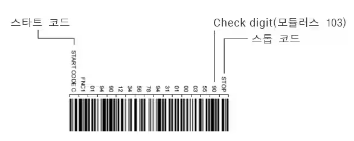

```
전세계에는 100여 종의 바코드가 사용되고 있음 그 중 CODE128과 GS1-128에 대해 학습
```

# Code128 BarCode란
- 1981년 컴퓨터 아이덴틱스(미국)가 개발한 바코드
- 아스키 코드 128문자(숫자, 알파벳 대문자/소문자, 기호, 제어 코드) 전부를 바코드화 가능.
- 즉, 컴퓨터의 키보드로 입력할 수 있는 문자(한자, 히라가나, 카타카나 제외)를 모두 표시할 수 있음



- 바의 사이즈는 4단계로 구분
- 바 3개와 스페이스 3개로 1문자를 표시 (총 6개)
- 스타트 Character(CODE)는 3종류가 있음 (CODE-A, CODE-B, CODE-C)
- 너무 자세히는 아직 알 것 없고 아스키코드로 문자를 변환해서 CODE Charater에 맞게 바코드 두께 형태로 문자를 변환한다는 의미

- 특징
    - 바의 사이즈가 4종류이므로 사용할 프린터의 인쇄 정밀도가 높아야 함
    - 도트 임팩트 프린터, FA용 잉크젯 프린터, 골판지 상자용 플렉소 인쇄와는 맞지 않음
    - CODE-C 만을 사용하여 숫자로만 구성할 경우, 매우 고밀도의 바코드를 제작할 수 있음
    - 대표적인 업계
        - 체인점, 백화점 협회
        - 의료 재료 업계
        - 편의점 업계
        - 식육 업계